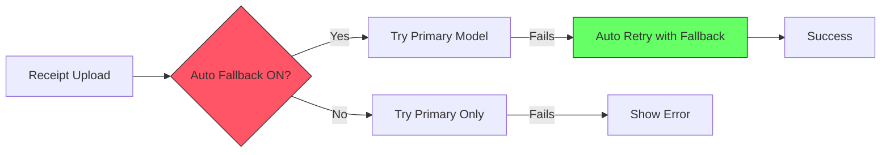

# 📋 Changelog v1.3.0

**Release Date**: 2026-01-15  
**Version**: 1.3.0  
**Type**: Feature Release

---

## 🎯 Overview

Major release combining receipt processing improvements with comprehensive UI refinements. Enhanced the Auto Fallback system with better visual feedback and perfected the Appwrite-inspired theme for professional appearance across all modes.

---

## 🚀 Receipt Processing Enhancements

### Batch Processing & Queue System

**What Changed**: New multi-step upload workflow supporting batch image processing

**Why**: Users often have multiple receipts to upload at once; processing one by one was tedious

**Impact**:
- ✅ **Bulk Upload**: Select multiple images at once to create a processing queue
- ✅ **Sequential Processing**: Smart queue handles images one by one with progress tracking
- ✅ **Strict Validation**: Processing aborts if any image fails to ensure no receipts are missed
- ✅ **Metadata Pre-fill**: Set Platform and Date for all images _before_ processing

### Advanced Image Previews

**What Changed**: interactive preview system for upload queue

**Why**: Users need to verify image quality and content before committing to OCR processing

**Impact**:
- ✅ **Thumbnail Grid**: Visual list of all pending uploads
- ✅ **Full-Screen Lightbox**: Click any thumbnail to view high-res version
- ✅ **Zoom Capabilities**: Inspect receipt details clearly
- ✅ **Queue Management**: easily remove individual images from the batch

### Auto Fallback Toggle Improvements

**What Changed**: Redesigned Auto Fallback toggle with clear visual states and improved accessibility

**Why**: Users need immediate visual confirmation of whether auto-fallback is enabled when processing receipts

**Impact**: 
- ✅ **Active state**: Solid pink background (`bg-pink-500`) clearly indicates fallback is ON
- ✅ **Inactive state**: Gray background (`bg-gray-700`/`bg-gray-300`) shows fallback is OFF
- ✅ **Smooth transitions**: 200ms animation provides professional feedback
- ✅ **Function**: When enabled, automatically falls back to alternative models if primary fails during receipt OCR

**Technical Details**:
- Fixed CSS variable issue preventing opacity modifiers
- Direct color classes (`bg-pink-500`) replace `bg-primary` for reliability
- Theme-aware styling ensures visibility in both light and dark modes



### Model Selection UI

**What Changed**: Settings panel dropdown for model selection now uses solid pink highlighting

**Why**: Users need clear visual confirmation of selected OCR model

**Impact**:
- ✅ Selected model shown with solid pink background for instant recognition
- ✅ Hover states provide progressive feedback
- ✅ Dropdown works reliably in both light and dark themes
- ✅ Model preferences persist across sessions

---

## 🎨 Theme & Design Refinements

### Modal System Overhaul

**What Changed**: Complete redesign of modal presentation layer with proper backdrop blur and solid panel backgrounds

**Why**: Previous modals had transparency issues making content hard to read, especially in dark mode

**Impact**: 
- ✅ Crystal-clear modal readability in both light and dark modes
- ✅ Professional glassmorphism effect with blurred backdrops
- ✅ Solid panel backgrounds (white/zinc-900) eliminate text visibility issues
- ✅ Consistent visual hierarchy across all dialogs

```mermaid
graph LR
    A[Modal Trigger] --> B[Blurred Backdrop]
    B --> C[Solid Panel]
    C --> D[Sharp Content]
    style B fill:#000,stroke:#f56,opacity:0.4
    style C fill:#fff,stroke:#333
    style D fill:#fff,stroke:#f56
```



### Button Color Consistency

**What Changed**: Standardized button color scheme across all components

**Why**: Inconsistent pink/gray usage across light and dark modes created visual confusion

**Impact**:
- ✅ **Add Receipt**: Pink (`bg-pink-500`) in both modes - primary action
- ✅ **Manage People**: Gray (`bg-gray-100`/`bg-gray-800`) in both modes - secondary action
- ✅ **Settings**: Subtle border hover with pink accent
- ✅ **Cancel**: Consistent secondary button styling

### Auto Fallback Toggle

**What Changed**: Redesigned toggle switch with proper contrast and pink accent

**Why**: Toggle was using CSS variables that didn't support opacity modifiers, causing visibility issues

**Impact**:
- ✅ Active state: Solid pink (`bg-pink-500`) with white toggle
- ✅ Inactive state: Gray (`bg-gray-700`/`bg-gray-300`) based on theme
- ✅ Smooth 200ms transition for professional feel
- ✅ Clear visual feedback for on/off states

### Dropdown Styling

**What Changed**: Settings panel model dropdown now uses solid pink for selected items

**Why**: Subtle border-left design was too understated for user feedback

**Impact**:
- ✅ Selected item: Solid pink background (`bg-pink-500`) with white text
- ✅ Hover state: Pink tint (`bg-pink-500/20` or `bg-pink-100`)
- ✅ Unselected items: Clean gray text
- ✅ Solid borders (`border-gray-200`/`border-gray-700`) for proper contrast

---

## ✨ New Features

### Clickable Empty State

**What Changed**: "No receipts uploaded yet" area is now a fully interactive upload trigger

**Why**: Users expect to click the empty state to upload - common UX pattern

**Impact**:
- ✅ Click anywhere in the dashed box to open upload modal
- ✅ Upload icon and "Click to upload" text provide clear affordance
- ✅ Hover effects: Pink border + background tint
- ✅ Theme-aware hover: `zinc-900/50` background in dark mode, pink-50 in light mode

### Name Capitalization

**What Changed**: People names are automatically capitalized when added

**Why**: Ensures consistent formatting regardless of user input

**Impact**:
- ✅ Automatic title case for all names (e.g., "john doe" → "John Doe")
- ✅ Handles multi-word names correctly
- ✅ Professional appearance in all UI displays

---

## 🐛 Bug Fixes

### Dark Mode Modal Backgrounds

**What Changed**: Fixed white background appearing in dark mode modals

**Why**: CSS `dark:` classes weren't being applied properly due to missing theme detection

**Impact**:
- ✅ People manager modal now properly dark in dark mode
- ✅ Upload modal maintains solid backgrounds
- ✅ All modals use theme-aware styling via `isDark` state

### Empty State Visibility

**What Changed**: Empty state now has proper background transparency in dark mode

**Why**: Area was too light and hard to see against dark background

**Impact**:
- ✅ Dark mode: Semi-transparent dark background (`zinc-900/50`)
- ✅ Light mode: Transparent background
- ✅ Hover states clearly visible in both themes
- ✅ Pink accent colors maintain brand consistency

### Lint Errors

**What Changed**: Removed unused imports and variables

**Why**: Clean codebase without warnings

**Impact**:
- ✅ Removed unused `Check` icon import
- ✅ Removed unused `selected` parameter in dropdown render function
- ✅ Zero linting errors in modified components

---

## 📊 Statistics

- **Files Changed**: 4
- **Components Updated**: 4 (people-manager, receipt-grid, settings-panel, upload-modal)
- **Receipt Processing Features**: 4 (Batch Queue, Image Previews, Auto Fallback, Model Selection)
- **UI/UX Features**: 2 (Clickable empty state, Name capitalization)  
- **Bug Fixes**: 3 (Modal backgrounds, Empty state visibility, Lint errors)
- **Design Refinements**: 5 (Buttons, Toggle styling, Dropdown, Modals, Hover effects)

---

## 🚀 Upgrade Guide

### Prerequisites
- ✅ No breaking changes - fully backward compatible
- ✅ No database migrations required
- ✅ No configuration changes needed

### Steps
1. Pull latest code
2. Restart dev server if running
3. Clear browser cache (Ctrl+Shift+R) to see new styles
4. Test modal interactions in both light and dark modes

### Rollback Plan
```bash
git checkout v1.2.6
npm run dev
```

---

## 🎨 Design System Updates

### Color Palette

| Element | Light Mode | Dark Mode |
|---------|------------|-----------|
| Primary Button | `bg-pink-500` | `bg-pink-500` |
| Secondary Button | `bg-gray-100` | `bg-gray-800` |
| Modal Panel | `bg-white` | `bg-zinc-900` |
| Modal Backdrop | `bg-black/40 backdrop-blur-sm` | `bg-black/40 backdrop-blur-sm` |
| Empty State | `bg-transparent` | `bg-zinc-900/50` |
| Toggle Active | `bg-pink-500` | `bg-pink-500` |
| Toggle Inactive | `bg-gray-300` | `bg-gray-700` |
| Dropdown Selected | `bg-pink-500 text-white` | `bg-pink-500 text-white` |
| Dropdown Hover | `bg-pink-100` | `bg-pink-500/20` |

---

## 🐛 Known Issues

None identified in this release.

---

## 👥 Contributors

- Antigravity AI - UI/UX refinements and theme consistency

---

## 🔗 References

- Previous Version: v1.2.6
- Theme Inspiration: Appwrite.io
- Design System: Tailwind CSS v4

---

**Generated**: 2026-01-15  
**Author**: Automated Changelog Generator
