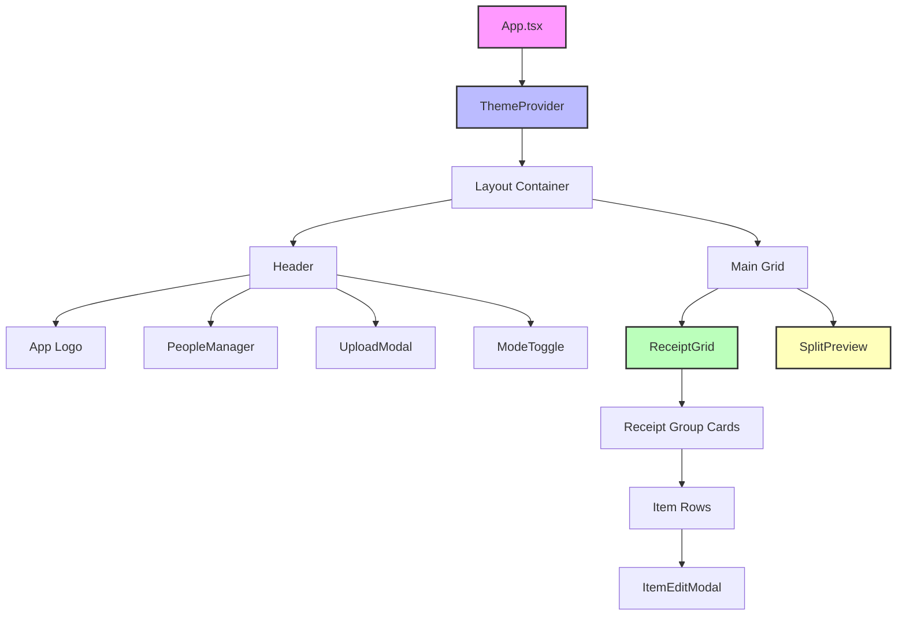
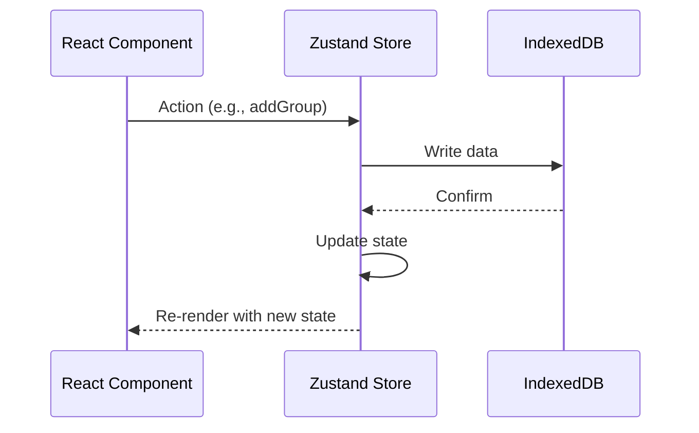
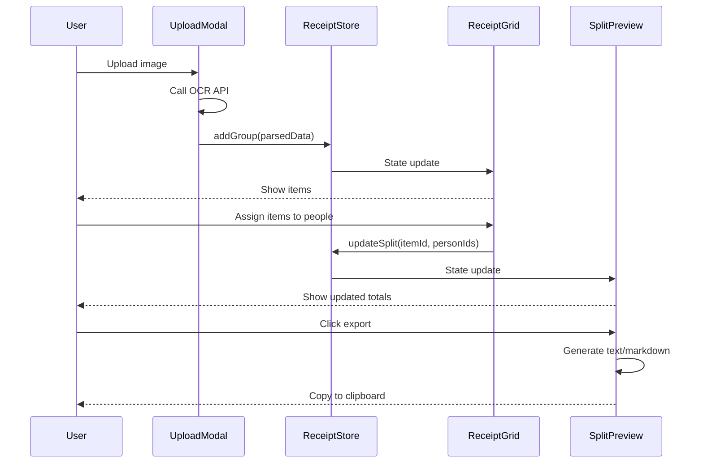

# Frontend Architecture

## Component Hierarchy

The Eazy Split client follows a hierarchical component structure with clear separation of concerns.



## Component Descriptions

### Root Level

#### App ([src/App.tsx](../src/App.tsx))
**Purpose**: Root component that orchestrates the entire application layout.

**Responsibilities**:
- Wraps app in ThemeProvider for dark/light mode
- Defines main layout structure (header + main grid)
- Provides gradient background overlays
- Manages responsive breakpoints

**Key Features**:
- Sticky header with backdrop blur
- Two-column layout (grid on left, preview on right)
- Responsive design (stacks on mobile)

### Header Components

#### PeopleManager ([src/components/people-manager.tsx](../src/components/people-manager.tsx))
**Purpose**: Manage the list of people for splitting receipts.

**Features**:
- Add new person with name and optional emoji
- Edit existing people
- Remove people
- Stored in IndexedDB via `usePeopleStore`

**UI Pattern**: Modal dialog with form inputs

#### UploadModal ([src/components/upload-modal.tsx](../src/components/upload-modal.tsx))
**Purpose**: Upload receipt images or create manual receipts.

**Features**:
- File upload (drag-drop or click)
- Platform selection (dropdown)
- Date picker
- OCR processing integration
- Manual item entry fallback

**Data Flow**:
1. User uploads image
2. Send to server `/api/ocr`
3. Receive parsed items
4. Create ReceiptGroup in store

#### ModeToggle ([src/components/mode-toggle.tsx](../src/components/mode-toggle.tsx))
**Purpose**: Toggle between dark and light themes.

**Implementation**: Uses ThemeProvider context to switch themes

### Main Content Components

#### ReceiptGrid ([src/components/receipt-grid.tsx](../src/components/receipt-grid.tsx))
**Purpose**: Display all receipt groups and their items in an editable grid.

**Structure**:
- Groups receipts by platform + date
- Each group shows items in rows
- Each row has: item name, price, person checkboxes, "All" checkbox

**Interactions**:
- Click item to edit (opens ItemEditModal)
- Toggle checkboxes to assign people
- Add/remove items
- Delete entire group

**State**: Connected to `useReceiptStore` and `usePeopleStore`

#### SplitPreview ([src/components/split-preview.tsx](../src/components/split-preview.tsx))
**Purpose**: Live preview of per-person totals and export actions.

**Features**:
- Real-time calculation as assignments change
- Per-person breakdown
- Unassigned items warning
- Grand total
- Export buttons (text/markdown)

**Calculation**: Uses `calculateSplits()` from [src/lib/splitter.ts](../src/lib/splitter.ts)

#### ItemEditModal ([src/components/item-edit-modal.tsx](../src/components/item-edit-modal.tsx))
**Purpose**: Edit item name and price inline.

**UI Pattern**: Modal dialog with form inputs

### Theme Components

#### ThemeProvider ([src/components/theme-provider.tsx](../src/components/theme-provider.tsx))
**Purpose**: Provide theme context (dark/light/system) to entire app.

**Implementation**: React Context API with localStorage persistence

## State Management Pattern

The app uses **Zustand** for global state with **IndexedDB** for persistence.



### State Stores

1. **usePeopleStore** ([src/store/usePeopleStore.ts](../src/store/usePeopleStore.ts))
   - Manages people list
   - CRUD operations
   - Persists to IndexedDB `people` store

2. **useReceiptStore** ([src/store/useReceiptStore.ts](../src/store/useReceiptStore.ts))
   - Manages receipt groups
   - Manages split assignments
   - Persists to IndexedDB `receipts` and `splits` stores

See [State Management](./state_management.md) for details.

## Data Flow

### Primary User Flow: Upload → Assign → Export



## Routing

The app is a **Single Page Application (SPA)** with no client-side routing. All functionality is on one page.

**Future Enhancement**: Add React Router for:
- `/` - Main app
- `/history` - Past receipts
- `/settings` - User preferences

## Build Configuration

### Vite Setup ([vite.config.ts](../vite.config.ts))

```typescript
import { defineConfig } from 'vite'
import react from '@vitejs/plugin-react'

export default defineConfig({
  plugins: [react()],
  resolve: {
    alias: {
      '@': '/src'  // Enables @/ imports
    }
  }
})
```

### TypeScript Configuration

- **tsconfig.app.json**: App-specific settings (strict mode, React JSX)
- **tsconfig.node.json**: Node/build tool settings
- **tsconfig.json**: Base configuration

### Tailwind CSS ([tailwind.config.js](../tailwind.config.js))

Custom configuration with:
- Extended color palette
- Custom breakpoints
- Plugin support (Headless UI)
- Dark mode class strategy

## Styling Architecture

### CSS Structure

1. **Global Styles** ([src/index.css](../src/index.css))
   - Tailwind directives
   - CSS custom properties for theming
   - Base typography

2. **Component Styles** ([src/App.css](../src/App.css))
   - Component-specific overrides
   - Animation keyframes

3. **Utility Classes**
   - Tailwind utilities used inline in JSX
   - Custom utilities via Tailwind config

### Theme System

**CSS Variables** (defined in `index.css`):
```css
:root {
  --background: ...;
  --foreground: ...;
  --primary: ...;
  /* etc */
}

.dark {
  --background: ...;
  --foreground: ...;
  /* Dark mode overrides */
}
```

**Usage in Components**:
```tsx
<div className="bg-background text-foreground">
  {/* Automatically adapts to theme */}
</div>
```

## Performance Optimizations

### Code Splitting
- Currently single bundle (small enough)
- Future: Split by route if adding pages

### React Optimizations
- Zustand prevents unnecessary re-renders
- Functional updates in stores
- Memoization where needed (React.memo)

### Asset Optimization
- Vite automatically optimizes images
- Tree-shaking removes unused code
- Minification in production build

## Accessibility

### ARIA Labels
- All interactive elements have labels
- Form inputs have associated labels
- Modal dialogs have proper roles

### Keyboard Navigation
- Tab order follows visual order
- Escape closes modals
- Enter submits forms

### Screen Reader Support
- Semantic HTML elements
- Live regions for dynamic updates
- Descriptive button text

## Error Handling

### Strategy
1. **Try-Catch**: Wrap async operations
2. **Console Logging**: Debug errors in development
3. **User Feedback**: Show error messages in UI
4. **Graceful Degradation**: Fall back to manual entry if OCR fails

### Example (from UploadModal):
```typescript
try {
  const result = await uploadToOCR(file);
  addGroup(result);
} catch (error) {
  console.error('OCR failed:', error);
  // Allow manual entry instead
}
```

## Future Architecture Considerations

### Potential Enhancements
1. **Service Worker**: Full PWA with offline caching
2. **Web Workers**: Offload calculations for large receipts
3. **Virtual Scrolling**: Handle 1000+ items efficiently
4. **State Persistence**: Sync across devices via backend
5. **Component Library**: Extract reusable components to separate package

### Scalability
- Current architecture handles 100s of receipts easily
- IndexedDB supports GBs of data
- Zustand scales well with more stores
- Consider Redux if state becomes very complex

## References

- [State Management](./state_management.md)
- [UI Components](./ui_components.md)
- [Data Persistence](./data_persistence.md)
