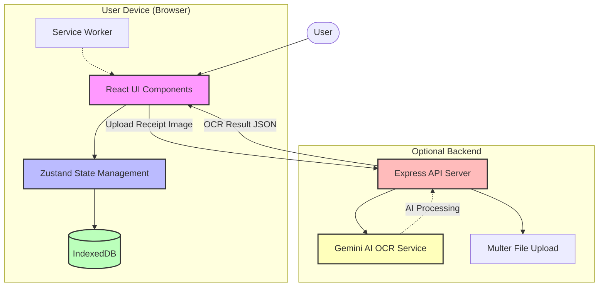
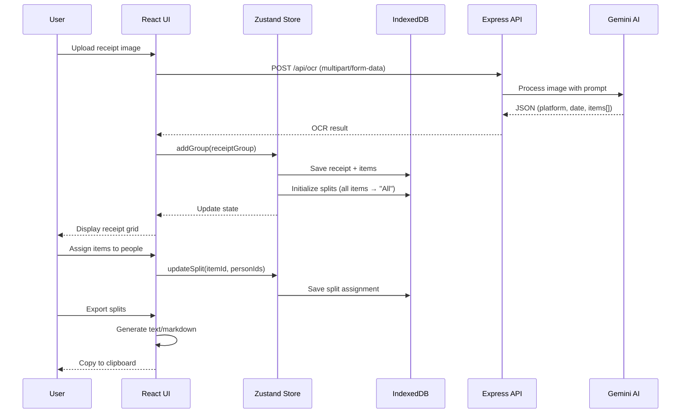
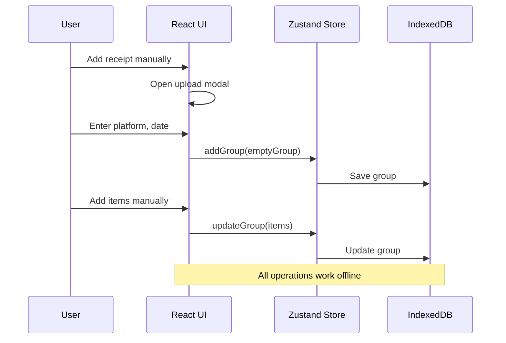

# Eazy Split - System Architecture

## Overview

Eazy Split is a Progressive Web App (PWA) for splitting grocery/delivery receipts among multiple people. The system consists of two main components:

- **Client**: React-based PWA that runs entirely in the browser with offline capabilities
- **Server**: Optional Express API for OCR processing using Google's Gemini AI

## System Architecture Diagram

## Component Boundaries

### Client (Frontend PWA)

**Responsibility**: Complete user interface and business logic for receipt splitting

**Key Modules**:
- UI Components ([src/components/](../client/src/components))
- State Management ([src/store/](../client/src/store))
- Data Persistence ([src/lib/db.ts](../client/src/lib/db.ts))
- Split Calculation ([src/lib/splitter.ts](../client/src/lib/splitter.ts))
- Export System ([src/lib/export.ts](../client/src/lib/export.ts))

**Technology Stack**:
- React 19.2.0 + TypeScript
- Vite (build tool)
- Zustand (state management)
- IndexedDB via `idb` (persistence)
- Tailwind CSS 4.x (styling)
- Headless UI + Heroicons (UI components)
- Framer Motion (animations)

**Data Storage**: All user data (people, receipts, split assignments) stored locally in IndexedDB

### Server (Backend API)

**Responsibility**: OCR processing for receipt images using Gemini AI

**Key Modules**:
- Express Server ([src/index.ts](../server/src/index.ts))
- OCR Routes ([src/routes/ocr.ts](../server/src/routes/ocr.ts))
- Gemini Service ([src/services/gemini.ts](../server/src/services/gemini.ts))

**Technology Stack**:
- Node.js + Express 5.x
- TypeScript
- Multer (file upload)
- Google Generative AI SDK
- CORS enabled

**External Dependencies**: Google Gemini API (Supports Gemini 2.0 Flash, 2.5 Flash, etc.)

## Data Flow

### Primary Flow: Receipt Upload → OCR → Split → Export

### Offline Flow: Manual Entry

## Security & Privacy

### Client-Side Security
- **Data Privacy**: All user data stored locally in browser (IndexedDB)
- **No Server Dependency**: App fully functional without backend
- **HTTPS Only**: PWA requires secure context
- **No Tracking**: No analytics or third-party scripts

### Server-Side Security
- **CORS Enabled**: Allows cross-origin requests from client
- **File Cleanup**: Uploaded images deleted after processing
- **API Key Protection**: Gemini API key stored in environment variables
- **No Data Retention**: Server does not store user data

> [!WARNING]
> The server currently disables SSL verification (`NODE_TLS_REJECT_UNAUTHORIZED = '0'`) for corporate proxy compatibility. This should be removed in production environments.

## Deployment Model

### Client Deployment
- **Target**: Static hosting (Vercel, Netlify, GitHub Pages)
- **Build**: `npm run build` → `dist/` folder
- **PWA**: Service worker for offline caching (if configured)
- **CDN**: Static assets served via CDN

### Server Deployment
- **Target**: Node.js hosting (Heroku, Railway, AWS, Azure)
- **Port**: Configurable via `PORT` env variable (default: 3000)
- **Environment Variables**:
  - `GEMINI_API_KEY`: Google Gemini API key (required)
  - `PORT`: Server port (optional, default 3000)

### Recommended Setup
1. **Development**: Run both client and server locally
2. **Production**: 
   - Client: Deploy to static hosting
   - Server: Deploy to serverless/container platform
   - Configure CORS to allow client domain

## Key Design Decisions

### Why Client-First Architecture?
- **Privacy**: User data never leaves device by default
- **Offline**: Works without internet connection
- **Speed**: No network latency for core operations
- **Cost**: No backend infrastructure required for basic usage

### Why Optional Server?
- **OCR Quality**: Gemini AI provides better accuracy than client-side OCR
- **Performance**: Image processing offloaded from mobile devices
- **Flexibility**: Users can choose manual entry or automated OCR

### Why IndexedDB?
- **Capacity**: Stores large amounts of structured data
- **Performance**: Fast queries and updates
- **Persistence**: Data survives browser restarts
- **Structure**: Better than localStorage for complex data

### Why Zustand?
- **Simplicity**: Minimal boilerplate vs Redux
- **TypeScript**: Excellent type inference
- **DevTools**: React DevTools integration
- **Size**: ~1KB gzipped

## Performance Characteristics

### Client Performance
- **Initial Load**: ~200KB gzipped (React + dependencies)
- **Time to Interactive**: <2s on 3G
- **Offline**: Full functionality after first load
- **Storage**: ~5MB typical usage (100 receipts)

### Server Performance
- **OCR Latency**: 2-5 seconds per image
- **Throughput**: Limited by Gemini API rate limits
- **Memory**: ~50MB per request (image buffering)

## Future Considerations

### Potential Enhancements
- **Multi-device Sync**: Optional encrypted cloud backup
- **Collaborative Splitting**: Real-time collaboration via WebSockets
- **Receipt Templates**: Platform-specific parsing rules
- **Export Formats**: PDF, CSV, Excel
- **Analytics**: Spending insights and trends

### Scalability
- **Client**: Scales to device storage limits
- **Server**: Horizontal scaling with load balancer
- **Database**: Add PostgreSQL for sync feature

## References

- [Technical Plan](../pwa_receipt_splitter_technical_plan_api_spec.md)
- [Client Documentation](../client/docs/index.md)
- [Server Documentation](../server/docs/index.md)
