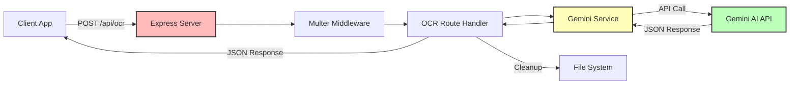

# Backend Architecture

## Server Structure

The Eazy Split server is a minimal Express API with a single purpose: OCR processing for receipt images.

## Component Diagram



## Express Server Setup

**Location**: [src/index.ts](../src/index.ts)

```typescript
import express from 'express';
import cors from 'cors';
import ocrRoutes from './routes/ocr';

const app = express();
const PORT = process.env.PORT || 3000;

app.use(cors());
app.use(express.json());
app.use('/api/ocr', ocrRoutes);

app.listen(PORT, () => {
  console.log(`Server running on port ${PORT}`);
});
```

### Middleware Stack

1. **CORS**: Allows cross-origin requests from client
2. **express.json()**: Parses JSON request bodies
3. **OCR Routes**: Handles `/api/ocr` endpoints

### SSL Verification Disabled

```typescript
process.env.NODE_TLS_REJECT_UNAUTHORIZED = '0';
```

**Why?** Corporate proxies may use self-signed certificates.

**Production**: Remove this line and use proper SSL certificates.

## Route Structure

**Location**: [src/routes/ocr.ts](../src/routes/ocr.ts)

```typescript
import express from 'express';
import multer from 'multer';
import { processReceiptImage } from '../services/gemini';

const router = express.Router();
const upload = multer({ dest: 'uploads/' });

router.post('/', upload.single('image'), async (req, res) => {
  // Handle OCR request
});

router.get('/health', (req, res) => {
  res.send('OCR Service Running');
});

export default router;
```

### Endpoints

- **POST /api/ocr**: Upload and process receipt image
- **GET /api/ocr/health**: Health check

## File Upload Handling

### Multer Configuration

```typescript
const upload = multer({ dest: 'uploads/' });
```

**Storage**: Files saved to `uploads/` directory with random names.

**Middleware**: `upload.single('image')` expects form field named `image`.

### File Cleanup

After processing, files are deleted:

```typescript
fs.unlinkSync(req.file.path);
```

**Why?** Prevent disk space accumulation.

## Error Handling

### Strategy

1. **Try-Catch**: Wrap async operations
2. **HTTP Status Codes**: 400 (bad request), 500 (server error)
3. **Cleanup on Error**: Delete uploaded file even if processing fails

### Example

```typescript
try {
  const result = await processReceiptImage(req.file.path, req.file.mimetype);
  fs.unlinkSync(req.file.path);
  res.json(result);
} catch (error) {
  if (req.file && fs.existsSync(req.file.path)) {
    fs.unlinkSync(req.file.path);
  }
  res.status(500).json({ error: error.message });
}
```

## TypeScript Configuration

**Location**: [tsconfig.json](../tsconfig.json)

```json
{
  "compilerOptions": {
    "target": "ES2020",
    "module": "commonjs",
    "outDir": "./dist",
    "rootDir": "./src",
    "strict": true,
    "esModuleInterop": true
  }
}
```

**Build Output**: `dist/` directory

## Dependencies

### Production

- **express**: HTTP server framework
- **cors**: Cross-origin resource sharing
- **multer**: File upload middleware
- **dotenv**: Environment variable loading
- **@google/generative-ai**: Gemini AI SDK

### Development

- **typescript**: TypeScript compiler
- **ts-node**: Run TypeScript directly
- **nodemon**: Auto-restart on file changes
- **@types/\***: Type definitions

## Deployment Considerations

### Environment Variables

Ensure `GEMINI_API_KEY` is set in production environment.

### File Storage

**Current**: Local file system (`uploads/` directory)

**Production**: Consider:
- Temporary storage (files deleted after processing)
- Cloud storage (S3, GCS) for persistence
- In-memory processing (no disk writes)

### Scaling

**Horizontal Scaling**: Multiple instances behind load balancer

**Considerations**:
- Stateless (no session storage)
- File uploads to shared storage
- Gemini API rate limits

## Future Enhancements

### 1. Authentication

Add JWT-based authentication:

```typescript
import jwt from 'jsonwebtoken';

const authMiddleware = (req, res, next) => {
  const token = req.headers.authorization?.split(' ')[1];
  if (!token) return res.status(401).json({ error: 'Unauthorized' });
  
  try {
    const decoded = jwt.verify(token, process.env.JWT_SECRET);
    req.user = decoded;
    next();
  } catch (error) {
    res.status(401).json({ error: 'Invalid token' });
  }
};

router.post('/', authMiddleware, upload.single('image'), ...);
```

### 2. Rate Limiting

Prevent abuse:

```typescript
import rateLimit from 'express-rate-limit';

const limiter = rateLimit({
  windowMs: 15 * 60 * 1000, // 15 minutes
  max: 100 // limit each IP to 100 requests per windowMs
});

app.use('/api/ocr', limiter);
```

### 3. Request Validation

Validate image files:

```typescript
const fileFilter = (req, file, cb) => {
  if (file.mimetype.startsWith('image/')) {
    cb(null, true);
  } else {
    cb(new Error('Only images allowed'), false);
  }
};

const upload = multer({ dest: 'uploads/', fileFilter });
```

### 4. Logging

Add structured logging:

```typescript
import winston from 'winston';

const logger = winston.createLogger({
  level: 'info',
  format: winston.format.json(),
  transports: [
    new winston.transports.File({ filename: 'error.log', level: 'error' }),
    new winston.transports.File({ filename: 'combined.log' })
  ]
});

logger.info('OCR request received', { filename: req.file.originalname });
```

## References

- [OCR Service](./ocr_service.md)
- [API Endpoints](./api_endpoints.md)
